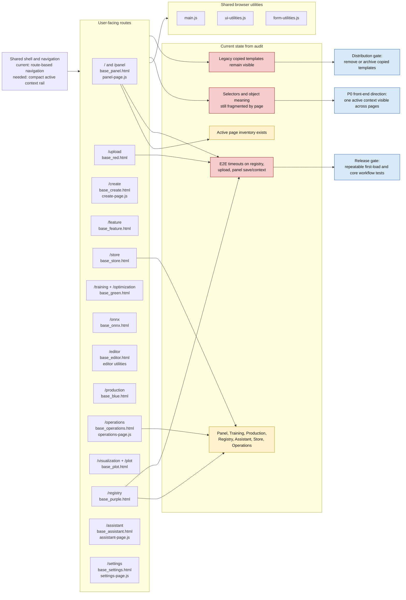
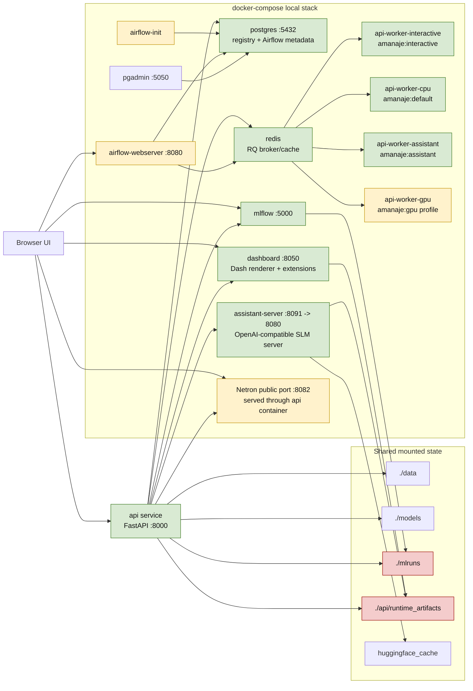
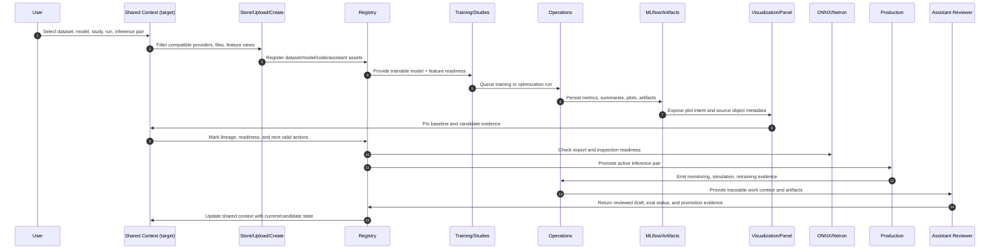
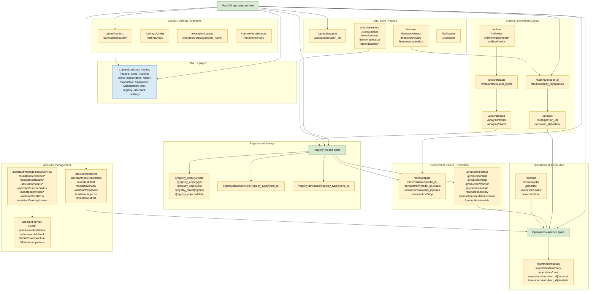

# Project Completeness Visualization

Date: 2026-05-22
Purpose: give Painel Amanaje a shared visual map for alignment, feedback, and next-release decisions.

This document accounts for the whole project by scope, not by claiming the product is complete. The scope is split into five lenses:

- Front-end surfaces: what users can see and navigate.
- Back-end control plane: what receives, validates, stores, queues, and returns work.
- Integrating systems: what the local stack connects to.
- Dynamics: how meaning should move through the system.
- Endpoints: how the route surface is organized today.

Primary inputs: `reports/cohesion-benchmark-audit.md` and `reports/next-release-completeness-roadmap.md`.

## 1. Whole-Project Coverage Atlas

```mermaid
flowchart TB
    User["ML engineer user"]
    Goal["Local-first MLOps control plane"]
    Context["Target shared context<br/>dataset, model, study, run, inference pair,<br/>artifact, device, environment"]
    Compare["Target comparison model<br/>baseline and candidate"]
    Readiness["Target readiness model<br/>trainable, comparable, deployable,<br/>monitorable, exportable, assistant-reviewed"]
    Evidence["Target evidence layer<br/>logs, ledgers, plots, MLflow, artifacts,<br/>operations, assistant reviews"]

    User --> Goal
    Goal --> Context
    Goal --> Compare
    Goal --> Readiness
    Goal --> Evidence

    subgraph FrontEnd["Front-end domains"]
        Panel["Panel / home<br/>workspace cockpit"]
        Upload["Upload<br/>dataset/model intake"]
        Create["Create and editor<br/>metadata/code asset creation"]
        FeatureStore["Feature + Store<br/>feature readiness"]
        Training["Training + optimization<br/>runs and studies"]
        Visualization["Visualization + Plot<br/>decision plots"]
        Registry["Registry<br/>objects, lineage, downloads"]
        Production["Production<br/>monitoring, simulation, retraining"]
        Operations["Operations<br/>runtime evidence"]
        Assistant["Assistant<br/>reviewable draft work"]
        Settings["Settings<br/>runtime config and logs"]
        Onnx["ONNX / Netron<br/>portability evidence"]
    end

    subgraph BackEnd["Back-end domains"]
        FastAPI["FastAPI app<br/>api/main_app.py"]
        RegistryModel["Generated registry CRUD<br/>dataset, learning, assistant,<br/>inference, study, code"]
        Utils["Utility modules<br/>training, MLflow, Optuna,<br/>monitoring, store, assistant, plots"]
        RunLedger["Run ledger<br/>runtime_artifacts/runs"]
        RuntimeArtifacts["Runtime artifacts<br/>training, plots, deployments,<br/>assistant, store"]
    end

    subgraph Integrations["Integrating systems"]
        Postgres["PostgreSQL<br/>registry + Airflow DB"]
        Redis["Redis/RQ<br/>queues"]
        MLflow["MLflow<br/>tracking + artifacts"]
        Airflow["Airflow<br/>pipeline integration"]
        Dashboard["Dash dashboard<br/>renderer + extensions"]
        AssistantServer["Assistant server<br/>OpenAI-compatible local SLM"]
        Netron["Netron<br/>model inspection"]
        GPU["Optional GPU worker<br/>profile-gated"]
    end

    Context --> Panel
    Context --> FeatureStore
    Context --> Training
    Context --> Visualization
    Context --> Production
    Context --> Registry
    Context --> Operations
    Context --> Assistant

    Compare --> Training
    Compare --> Visualization
    Compare --> Panel
    Compare --> Registry
    Compare --> Production

    Readiness --> Registry
    Readiness --> FeatureStore
    Readiness --> Onnx
    Readiness --> Production
    Readiness --> Assistant

    Evidence --> Operations
    Evidence --> MLflow
    Evidence --> RunLedger
    Evidence --> RuntimeArtifacts
    Evidence --> Dashboard

    Panel --> FastAPI
    Upload --> FastAPI
    Create --> FastAPI
    FeatureStore --> FastAPI
    Training --> FastAPI
    Visualization --> FastAPI
    Registry --> FastAPI
    Production --> FastAPI
    Operations --> FastAPI
    Assistant --> FastAPI
    Settings --> FastAPI
    Onnx --> FastAPI
    FastAPI --> RegistryModel
    FastAPI --> Utils
    FastAPI --> RunLedger
    FastAPI --> RuntimeArtifacts
    FastAPI --> Postgres
    FastAPI --> Redis
    FastAPI --> MLflow
    FastAPI --> Airflow
    FastAPI --> Dashboard
    FastAPI --> AssistantServer
    FastAPI --> Netron
    Redis --> GPU

    classDef mature fill:#d9ead3,stroke:#38761d,color:#111;
    classDef partial fill:#fff2cc,stroke:#bf9000,color:#111;
    classDef blocker fill:#f4cccc,stroke:#990000,color:#111;
    classDef target fill:#d9eaf7,stroke:#1155cc,color:#111;

    class Training,RunLedger,Redis,FastAPI mature;
    class Panel,Upload,Create,FeatureStore,Visualization,Registry,Production,Operations,Assistant,Onnx,Utils,Postgres,MLflow,Airflow,Dashboard,AssistantServer,Netron,GPU partial;
    class Context,Compare,Readiness,Evidence target;
```

## 2. Front-End Visualization

Front-end meaning: the UI is broad and operational, but its next release value comes from turning the pages into one cockpit instead of a set of capable islands.

## 3. Back-End Visualization

```mermaid
flowchart TB
    API["FastAPI control plane<br/>api/main_app.py"]

    subgraph RouteFamilies["Route families in main_app.py"]
        PageRoutes["HTML page routes"]
        PanelRoutes["Panel context + dashboards"]
        StoreRoutes["Store providers, catalog,<br/>preview, materialize, validate, refresh"]
        UploadRoutes["Upload support + object registration"]
        RuntimeRoutes["Runtime workers + accelerators"]
        ExecutionRoutes["Editor execution + queued jobs"]
        AssistantRoutes["Assistant sessions, refs,<br/>models, runtime, evals, drafts"]
        TrainingRoutes["Training, Optuna studies,<br/>runs list/get/control"]
        OperationsRoutes["Queues, summaries, runs,<br/>terminal, analysis"]
        PlotRoutes["Plot artifacts + files"]
        FeatureRoutes["Feature extraction,<br/>preview, materialize"]
        AnalysisRoutes["Dataset, model,<br/>object analysis"]
        RegistryRoutes["Generated CRUD,<br/>dependencies, downloads"]
        MLflowRoutes["MLflow redirects,<br/>experiments, health"]
        OnnxRoutes["ONNX prepare, validate,<br/>Netron status/open/stop"]
        ProductionRoutes["Production status, start,<br/>stop, monitor, retrain,<br/>history, simulation"]
        SettingsRoutes["Config + logs"]
    end

    subgraph DataModel["Registry and persistence"]
        ORM["SQLAlchemy ORM models"]
        Pydantic["Pydantic schemas"]
        GeneratedCRUD["ModelRegistry-generated CRUD"]
        Postgres["PostgreSQL database"]
    end

    subgraph Runtime["Runtime and artifact layer"]
        OperationQueue["operation_queue.py<br/>enqueue/cancel/status"]
        Workers["operation_worker.py<br/>interactive/cpu/assistant/gpu queues"]
        RunLedger["run_ledger.py<br/>JSON run entries"]
        TrainingUtils["training.py + optuna_utils.py"]
        MLflowUtils["mlflow_utils.py"]
        PlotRegistry["plot_registry.py"]
        StoreUtils["store_utils.py"]
        AssistantUtils["assistant_* utilities"]
        DeploymentUtils["deployment, monitoring,<br/>retrain, Netron utils"]
        Artifacts["runtime_artifacts + mlruns"]
    end

    API --> PageRoutes
    API --> PanelRoutes
    API --> StoreRoutes
    API --> UploadRoutes
    API --> RuntimeRoutes
    API --> ExecutionRoutes
    API --> AssistantRoutes
    API --> TrainingRoutes
    API --> OperationsRoutes
    API --> PlotRoutes
    API --> FeatureRoutes
    API --> AnalysisRoutes
    API --> RegistryRoutes
    API --> MLflowRoutes
    API --> OnnxRoutes
    API --> ProductionRoutes
    API --> SettingsRoutes
    API --> ORM
    API --> Pydantic

    RegistryRoutes --> GeneratedCRUD
    GeneratedCRUD --> ORM
    ORM --> Postgres
    Pydantic --> GeneratedCRUD

    TrainingRoutes --> TrainingUtils
    TrainingUtils --> MLflowUtils
    TrainingUtils --> RunLedger
    TrainingUtils --> Artifacts
    OperationsRoutes --> OperationQueue
    OperationQueue --> Workers
    Workers --> RunLedger
    OperationsRoutes --> RunLedger
    PlotRoutes --> PlotRegistry
    FeatureRoutes --> StoreUtils
    StoreRoutes --> StoreUtils
    AssistantRoutes --> AssistantUtils
    ProductionRoutes --> DeploymentUtils
    OnnxRoutes --> DeploymentUtils
    MLflowRoutes --> MLflowUtils

    classDef spine fill:#d9eaf7,stroke:#1155cc,color:#111;
    classDef current fill:#fff2cc,stroke:#bf9000,color:#111;
    classDef strong fill:#d9ead3,stroke:#38761d,color:#111;

    class API spine;
    class OperationQueue,Workers,RunLedger,TrainingUtils,MLflowUtils strong;
    class StoreUtils,AssistantUtils,DeploymentUtils,PlotRegistry current;
```

Back-end meaning: the backend already has the ingredients of a control plane. The cohesion work is to formalize shared contracts across route families, not merely add more endpoints.

## 4. Integrating Systems Visualization

Integration meaning: the local stack is no longer just API plus database. It is a distributed development control plane. The release risk is that generated runtime evidence is mixed with source state and the README/service descriptions lag behind the compose reality.

## 5. Dynamics Visualization

Dynamic meaning: the desired product direction is a feedback loop. The current implementation has most loop segments, but the active context, baseline/candidate roles, and readiness semantics are not yet central enough.

## 6. Endpoint Topology Visualization

Endpoint meaning: the API surface is now large enough that endpoint families need shared object contracts and lifecycle semantics. Registry and Operations should become the two main organizing backbones.

## Current State Matrix

| Lens | Coverage accounted for | Current state | Main direction |
| --- | --- | --- | --- |
| Front-end | 16 active routes, templates, page JS, shared UI utilities | Broad and usable, but page-local selectors still fragment meaning | Add one visible shared active context across Panel, Training, Visualization, Production, Registry, Store, Operations, and Assistant |
| Back-end | FastAPI route families, generated registry CRUD, SQLAlchemy/Pydantic models, utilities, run ledger, runtime artifacts | Operational control plane with a large monolithic route surface | Formalize context, comparison, readiness, and evidence contracts across endpoint families |
| Integrations | Postgres, Redis/RQ, MLflow, Airflow, Dash dashboard, assistant-server, Netron, optional GPU worker | Real local stack; compose is more advanced than parts of README imply | Make distribution clean and document the actual CPU/default/GPU profiles |
| Dynamics | Upload/create, Store/Feature, Registry, Training/Optuna, Visualization/plots, ONNX, Production, Operations, Assistant | Most workflow pieces exist, but users still assemble meaning across pages | Treat the product as a loop around shared context, baseline/candidate comparison, readiness, and evidence |
| Endpoints | UI pages, context/settings/runtime, data/store/feature, training/runs/plots, operations, registry, deployment/production, assistant | Wide endpoint coverage with growing overlap | Make Registry the lineage backbone and Operations the runtime evidence ledger |

## Alignment Questions

Use these questions when reviewing the visuals:

1. Is the intended center of the product Panel, Registry, Operations, or the shared active context itself?
2. Which object should users choose first in the happy path: dataset, model, run, or inference pair?
3. Should Store and Feature stay separate pages, or become one feature-readiness domain?
4. What makes a model "ready" for promotion: metrics only, comparison delta, ONNX validation, monitoring thresholds, assistant review, or all of them?
5. Should Operations be a universal ledger for every asynchronous action, including assistant, ONNX, Store, training, studies, and production jobs?
6. Which runtime artifacts are source fixtures, and which should be excluded from the distribution-clean release?

## Next Visual Iteration

After feedback, this map can be turned into a release board by adding owner, status, and acceptance criteria per node. The first concrete revision should connect each P0 roadmap item to exact endpoint families and UI routes:

- Global context contract.
- Baseline/candidate comparison.
- Visualization decision layer.
- Registry lineage/readiness.
- Distribution-clean local beta.
- E2E confidence gate.
